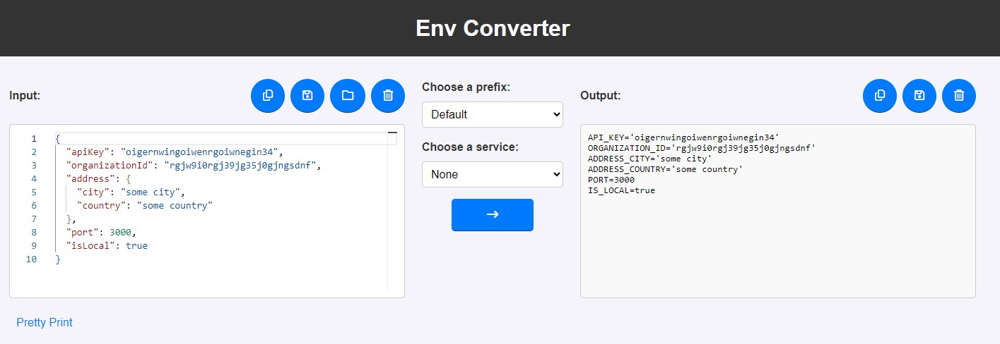
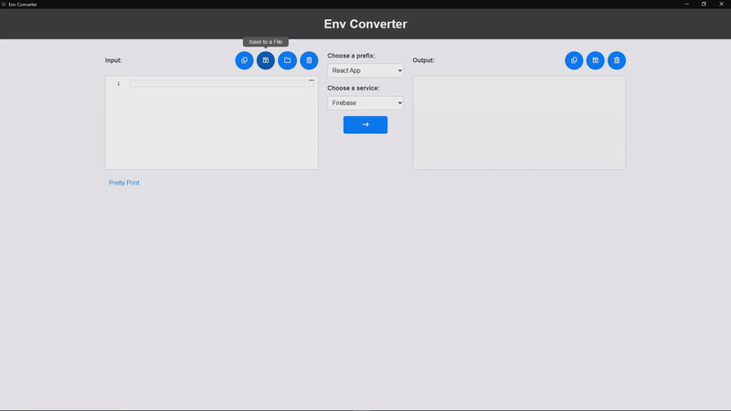
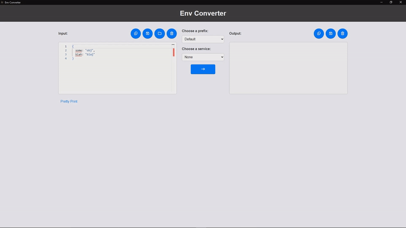
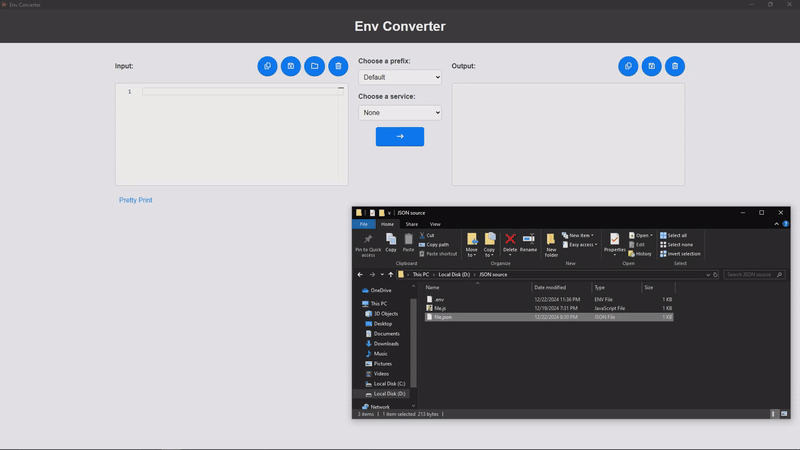

# Env Converter

Env Converter is a small desktop application designed to simplify the process of converting JSON configurations into `.env` format. It features a user-friendly interface with Monaco Editor integration for syntax highlighting, line numbering, and automatic layout. This project is ideal for developers working with various environments and APIs, allowing for easy configuration management.
It was created using Neutralinojs, a lightweight and portable framework for developing desktop applications. Neutralino provided the necessary number of tools to create this application.

## Features

- **Monaco Editor Integration**: Provides syntax highlighting, line numbers, and auto-indentation for comfortable JSON editing.
- **JSON-to-Env Conversion**: Converts JSON configuration files into `.env` format with specified prefixes and service options.
- **File Operations**: Supports copying to clipboard, saving files locally, and loading files.
- **Pretty Print**: Beautify JSON content with a single click for better readability.
- **Responsive Design**: Ensures usability across different screen sizes.

## Tech Stack

- **Frontend**: HTML, CSS, JavaScript
- **Editor**: [Monaco Editor](https://microsoft.github.io/monaco-editor/)
- **Development Framework**: Neutralino.js (It lets you develop lightweight cross-platform desktop applications using JavaScript, HTML and CSS)

## Installation

### Prerequisites

- Node.js and npm installed on your system

### Steps

1. Install neu CLI:
   ```bash
   npm install -g @neutralinojs/neu
   ```

2. Clone the repository:
   ```bash
   git clone https://github.com/alexkolitenkov/env-converter.git
   cd env-converter
   ```

4. Run the application:
   ```bash
   neu run
   ```

## Usage

1. **Input JSON**:
   - Paste your JSON configuration into the Monaco Editor.
   - Use the "Pretty Print" button to format your input.

2. **Choose Options**:
   - Select a prefix and a service from the dropdown menus.

3. **Convert**:
   - Click the "Convert" button to generate the `.env` output.

4. **Save or Copy**:
   - Save the `.env` file locally or copy it to the clipboard.

## Project Structure

```plaintext
.env-converter/
├── dist/                # Compiled files
├── js/                  # JavaScript files
│   ├── main.mjs         # Main application logic
│   ├── editor.mjs       # Monaco Editor integration
│   ├── utils.mjs        # Utility functions
│   ├── constants.mjs    # Constants for prefixes and services
│   └── neutralino.js    # Neutralino.js runtime
├── styles.css           # Application styling
└── index.html           # Main HTML file
```

## Development

To work on the project, use the following commands:

- **Start Development Server**:
  ```bash
  neu run
  ```

- **Build for Production**:
  ```bash
  neu build --release
  ```

## Acknowledgments

- [Monaco Editor](https://microsoft.github.io/monaco-editor/)
- [Neutralino.js](https://neutralino.js.org/)
- [Font Awesome](https://fontawesome.com/)


## Screenshots

<div style="display: flex; flex-direction: 'row'; gap: 5px; flex-wrap: wrap; align-items: center; justify-content: center;">

</div>

## Demo

<div style="display: flex; flex-direction: 'row'; gap: 5px; flex-wrap: wrap; align-items: center; justify-content: center;">




</div>